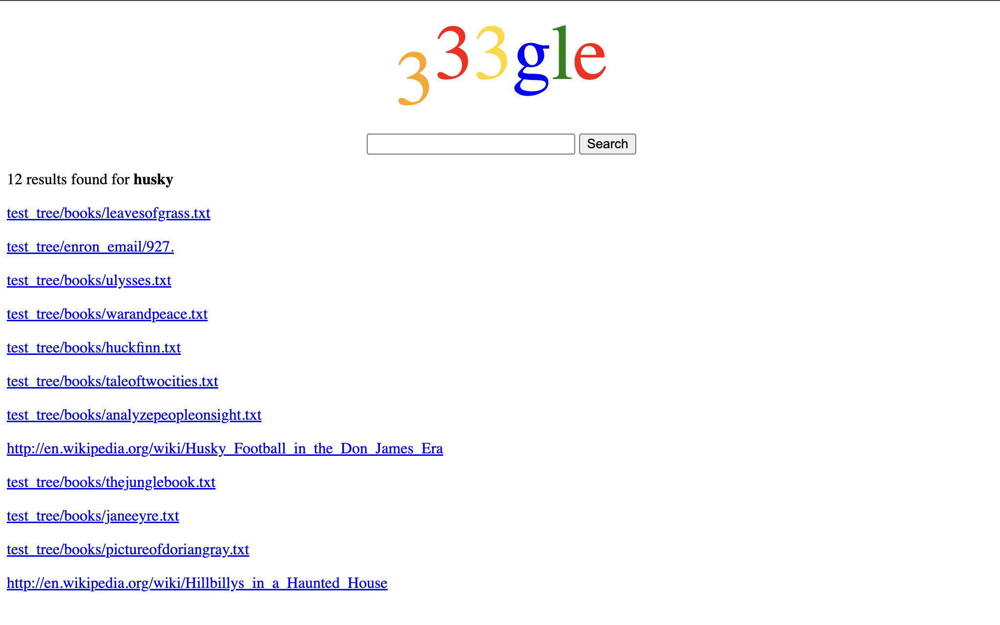

# 🌐 Mini Google Search Engine

This project is a full-stack **search engine** built entirely in **C and C++**, implementing everything from core data structures to a browser-accessible web interface. Designed with modular architecture, this system crawls file directories, indexes text data, persists it to disk, and serves user queries through a multithreaded web server.

> 🏫 Originally developed as part of the **University of Washington's CSE 333: Systems Programming** curriculum. This implementation and documentation reflect my own independent work and enhancements based on the course specifications.



------------------------------------------------------------------------

## 🧠 Key Highlights

-   ⚙️ **Systems-Level Programming** in C and C++
-   🧵 **Multithreaded Backend Server** (C++) handling concurrent requests
-   💾 **On-Disk Indexing** and binary serialization
-   🔍 **Inverted Index Search Engine** with ranking and scoring
-   🌐 **Socket Programming & HTTP** server supporting dynamic web search
-   🔒 Focus on **security**: XSS protection, path normalization, and safe memory handling
-   🧪 Thorough testing with **Valgrind** and custom Google Test suites

------------------------------------------------------------------------

## 🗂️ File Structure

``` bash
.
├── hw1/         # Linked List & Hash Table implementations
├── hw2/         # In-memory file system search engine
├── hw3/         # Disk-based indexer + query processor
├── hw4/         # Multithreaded web server + search frontend
|    └── test_tree/   # Example files and folder structure for crawling & testing
└── projdocs/    # Static website content for search UI
```

------------------------------------------------------------------------

## 🔧 Tech Stack & Skills Demonstrated

-   **Programming**: C, C++11, Makefile, Google Test
-   **Data Structures**: Doubly-linked List, Hash Tables, Memory-Safe Iterators
-   **Backend Systems**: File I/O, Directory Crawling, Inverted Index Construction
-   **Data Storage**: Binary Serialization, Byte-Level Offset Management, Endian Handling
-   **Networking**: TCP Sockets, HTTP/1.1 Protocol, MIME-Type Parsing
-   **Concurrency**: Thread Pools, Mutexes, Safe Connection Handling
-   **Security**: XSS Escaping, Path Sanitization, Memory Leak Prevention with Valgrind
-   **Frontend Integration**: Dynamic Search through Browser UI, Secure Static File Serving

------------------------------------------------------------------------

## 📦 Part 1 – Foundational Data Structures in C

This module implements robust and reusable system-level data structures:

-   **LinkedList** with safe iterators and destructor support for arbitrary payloads.
-   **HashTable** using chaining and flexible key/value storage.
-   Modular, tested using **Google Test** and memory-verified with **Valgrind**.

These components form the foundation for the in-memory index in later stages.

------------------------------------------------------------------------

## 📁 Part 2 – In-Memory Indexing Engine

Builds an inverted index from crawled text files and enables ranked querying from the command line.

-   **File Parser** extracts words and positional metadata from documents.
-   **DocTable** maintains mappings between file paths and numeric doc IDs.
-   **MemIndex** maps keywords → docIDs → list of word offsets.
-   **Search Shell** provides a basic CLI to search through indexed data.

Emphasized real-time data management, memory safety, and search result ranking based on term frequency.

------------------------------------------------------------------------

## 💾 Part 3 – Persistent Disk-Based Indexing (C++)

Transitions the in-memory structures to disk-backed storage with a robust binary format.

-   **WriteIndex** serializes DocTable and MemIndex using chained hash tables.
-   **Index Readers** reconstruct data from disk, supporting byte offset parsing, memory mapping, and endianness handling.
-   **Query Processor** loads disk indices and ranks multi-term queries efficiently.

This part sharpened my skills in **file format design**, **binary serialization**, and **efficient disk I/O**.

------------------------------------------------------------------------

## 🌐 Part 4 – Multithreaded HTTP Search Server

Implements a production-style **web search backend** with frontend integration.

-   **HTTP Server** built from scratch with:
    -   Thread pool for concurrent request handling
    -   URL parsing and HTTP response generation
    -   Safe serving of static files and search query results
-   **Dynamic Query Support** at `/search?terms=...`
-   **Static File Routing** for serving HTML/CSS/JS from `projdocs/`
-   **Security**: Prevents XSS via HTML escaping and disallows path traversal attacks

The final product functions like a miniature version of Google: search input on a browser, query served dynamically from disk, and results ranked and returned in milliseconds.

------------------------------------------------------------------------

## 🧠 What I Learned

> Building a search engine from scratch taught me more about backend architecture and systems-level design than any standalone course could.

-   How low-level systems handle **memory**, **data integrity**, and **concurrency**
-   How real-world tools like search engines use **indexing**, **ranking**, and **disk I/O optimization**
-   Why **threading**, **safe memory practices**, and **protocol parsing** are critical in scalable web systems
-   How to bridge the **gap between systems programming and user-facing interfaces**

------------------------------------------------------------------------

## 📚 Credits & Attribution

This project was developed as part of the **CSE 333: Systems Programming** course at the **University of Washington**, a class designed and taught by faculty including Prof. Hal Perkins. The original project specification and core design ideas belong to the course staff.

> All code, writeups, and enhancements in this repository are my own work unless otherwise noted, and are shared here for educational and professional demonstration purposes only.

------------------------------------------------------------------------

## 🚀 Demo

To try out the full search engine locally:

``` bash
cd Part\ 4/
make
./http333d 5555 ../projdocs unit_test_indices/*
Visit http://localhost:5555 in your browser and search!
```
